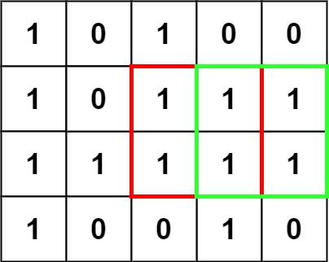

[](https://classroom.github.com/a/PChYfFfX)
[](https://classroom.github.com/online_ide?assignment_repo_id=12205414&assignment_repo_type=AssignmentRepo)
# Домашнее задание 2

Задания предполагают работу с динамическими и/или статическими массивами.

Большинство задач может быть решено средствами стандартной библиотеки, однако данное задание предполагает написание своих "велосипедов" (только в образовательных целях).

**Алгоритмическая сложность заданий не учитывается**, однако очень рекомендуется подумать над сложностью ваших алгоритмов.

**Замечание:** если тест не проходит, то нужно поправить ваш код, а не содержимое теста.

## Формулировка задачи

Необходимо реализовать следующие процедуры:
- `trace` - для вычисления следа квадратной матрицы.
- `sort` - любой алгоритм сортировки, который упорядочивает входную последовательность (в порядке возрастания). 
- `find_unique_element` - для вычисления уникального элемента в массиве.
- `find_max_square` - поиск максимальной площади (в качестве высоты и ширины выступают количество строк и столбцов соответственно) квадрата состоящего только из `1` в матрице состоящей только из `0` и `1`.

### sort
Эту задачу можно реализовать с помощью стандартной функции `std::sort`, однако данный кейс предполагает ручную реализацию любого алгоритма сортировки.

### find_unique_element

Эта задача предполагает, что все элементы входного массива, кроме одного, имеют пару (см. список тест. кейсов).

**hint:** Задача имеет решение, которое не требует использование дополнительной памяти.

Пример:
```text
input: [1, 2, 3, 1, 3, 3, 3]
output: 2
```

### find_max_square

Зеленые и красные квадраты показывают 2 кандидатов с максимальной площадью. Т.е. квадрат может быть не единственным. 

Для решения необходимо построить рекуррентное соотношение.



Примеры:
```text
input: [[0, 0], [0, 0]]
output: 0
```
```text
input: [[1, 0], [1, 0]]
output: 1
```
```text
input: [[1, 1], [1, 1]]
output: 4
```
```text
input: [[1, 1, 0], [1, 1, 0], [0, 0, 0]]
output: 4
```

В качестве примера входных данных удобно использовать тесты.

### Hint

Для сборки приложения из консоли следуют выполнить следующий набор инструкций:
```shell
mkdir build; cd build;
cmake .. -G <GeneratorName>
cmake --build .
```

Для запуска автотестов:
```shell
ctest . # or use -R <test-name> to run specific test
```
