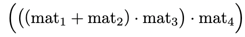

[](https://classroom.github.com/a/BiQMOK2y)
[](https://classroom.github.com/online_ide?assignment_repo_id=12327350&assignment_repo_type=AssignmentRepo)
# Домашнее задание 3

Разработайте утилиту командной строки для сложения и умножения матриц.
**Алгоритмическая сложность заданий не учитывается**, однако очень рекомендуется подумать над сложностью ваших алгоритмов.

**Замечание:** если тест не проходит, то нужно поправить ваш код, а не содержимое теста.

## Формулировка задачи

Программа должна принимать в качестве аргументов командной строки список файлов с матрицами,
разделённых командами-операциями, которые необходимо выполнить над матрицами.

**Пример запуска в терминале Unix/Linux:**

```shell
$ ./matrices mat1.txt --add mat2.txt --mult mat3.txt --mult mat4.txt
```

**В терминале Windows:**
```shell
C:\> matrices.exe mat1.txt --add mat2.txt --mult mat3.txt --mult mat4.txt
```

Необходимо поддержать две операции:
* `--add` (начинается с двух знаков минус) - сложение матриц,
* `--mult` - умножение матриц.

Операции необходимо выполнить в том порядке, в котором они указаны.

Например, в указанном выше примере необходимо сначала сложить матрицу
из **mat1.txt** c матрицей из **mat2.txt**,
затем умножить результат на матрицу из **mat3.txt**,
затем умножить результат на матрицу из **mat4.txt**:



Каждая матрица задаётся в отдельном текстовом файле.
На первой строке файла указаны два натуральных числа **N** и **M** -
соответственно количество строк и столбцов в матрице.
Далее следует **N** строк по **M** чисел с плавающей точкой.

```text
2 5
7.11 3.12 8.13 2.14 0.15
3.21 7.22 3.23 2.24 9.25
```

Результирующую матрицу необходимо вывести на экран (в терминал) в том же формате, в котором заданы входные матрицы.
Не допускается выводить какую-либо дополнительную или отладочную информацию.

## Обработка ошибок
**Данная задача не требует обязательного использования/знания исключений.**

В случае, если аргументы командной строки не соответствуют указанному выше формату, или, если невозможно произвести операцию над матрицами (например, сложение матриц разного размера),
программа должна вывести **осмысленное сообщение** об ошибке и завершиться с **ненулевым кодом** возврата (возвращаемым значением из функции **main**).

Необходимо проверять корректность открытия файла (например, приведя файловый поток к логическому типу), и,
если файл открыть не удалось, выводить сообщение об ошибке и завершать программу с ненулевым кодом возврата.
Если файл с матрицей успешно открылся, можно допустить, что он всегда будет успешно прочитан,
и что в нём всегда корректно сохранённая матрица в описанном выше формате.

## Дополнительные требования
Постарайтесь не допустить дублирования кода при работе с матрицами, разумно вынести такие операции в отдельные функции.

Разрешается и рекомендуется использование классов STL для хранения остальных сущностей, помимо матриц.
Например, для удобной работы со строками можно использовать **std::string**.

Разрешается, но не требуется, написание собственного класса матрицы.

## Параметры командной строки
Для того, чтобы обработать параметры командной строки, нужно использовать следующий синтаксис функции **main**:
```c++
int main(int argc, char ** argv)
```
* `argc` — количество параметров командной строки,
* `argv` — массив строк в стиле C.
* Строка с номером **0** в этом массиве — это имя самой команды, строки с номерами от **1** до **(argc - 1)** — это параметры командной строки.

Например, чтобы вывести все параметры командной строки
можно написать следующий код.
```c++
#include <iostream>

int main(int argc, char ** argv)
{
    for (auto i = 1; i < argc; ++i)
    {
        std::cout << i << ": " << argv[i] << std::endl;
    }
}
```

### Hint

Для сборки приложения из консоли следуют выполнить следующий набор инструкций:
```shell
mkdir build; cd build;
cmake .. -G <GeneratorName>
cmake --build .
```

Для запуска автотестов:
```shell
ctest . # or use -R <test-name> to run specific test
```
Либо запустить тесты из папки test с помощью bash-скрипта.
