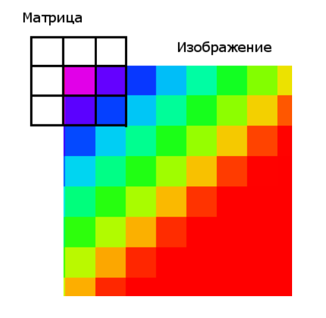

[](https://classroom.github.com/a/LMAD0v8L)
[](https://classroom.github.com/online_ide?assignment_repo_id=12473727&assignment_repo_type=AssignmentRepo)
# Домашнее задание 4

Напишите программу, которая выполняет фильтрацию изображения с помощью **фильтра Гаусса** ([Gaussian blur](https://en.wikipedia.org/wiki/Gaussian_blur)).


## Формулировка задачи

На вход вашей программе будет подано **цветное 3-канальное** (3 байта на пиксель) изображение в формате **BMP**. Необходимо произвести его цифровую обработку, а именно:
* Прочитать изображение с файловой системы.
* Применить к изображению сверточный фильтр Гаусса.
* Записать результирующее изображение на файловую систему.
Для чтения изображений и фильтрации необходимо использовать стандартные средства языка С++ (не нужно использовать сторонние библиотеки).

## Параметры командной строки

Пример запуска в терминале:
```shell
 $ ./blur -i input.bmp -o output.bmp -r 5
```

Описание параметров:
* `-i <path-to-image>` - относительный или абсолютный путь до входного изображения в формате BMP;
* `-o <path-to-image>` - относительный или абсолютный путь до результирующего изоб- ражения в формате BMP;
* `-r <size-in-pixels>` - размер ядра свертки.

Необходимо проверять корректность переданных аргументов: существование файлов, радиус фильтра.
В случае передачи некорректных аргументов.
Ваша программа должна писать ошибку в `std::cerr` и завершать работу с ненулевым кодом возврата.

## Замечания про бинарные форматы изображений

Практически любой бинарный формат изображений состоит из двух основных сегментов:
* **Заголовок** (header) с метаданными. В нем, как правило, описывается формат изображения и параметры, необходимые для корректного чтения сегмента с данными.
* **Сегмент данных** (data segment). В нем содержится плотно упакованная последовательность байт, которая кодирует исходное изображение.

Чтобы корректно прочитать изображение, необходимо:
* открыть файл для чтения побайтово;
* прочитать заголовок (как правило, фиксированное число байт);
* по значениям из заголовка понять: размер изображения, формат, смещение до сегмента с данными;
* прочитать данные в соответствии с заданным в заголовке формате в двумерный массив пикселей (bitmap).

## Рекомендации по чтению формата BMP

Данные в формате BMP состоят из следующих основных блоков:
* Заголовок из структуры `BITMAPFILEHEADER` и блока `BITMAPINFO`. Последний содержит:
  * информационные поля;
  * битовые маски для извлечения значений цветовых каналов (опциональные);
  * таблицу цветов (опциональная);
  * цветовой профиль (опциональный).
* Упакованные пиксельные данные.

Для чтения заголовков удобно использовать упакованные структуры данных. Пример такой структуры:
```c++
#pragma pack(push, 1) // disable alignment
struct BMPHeader
{
    std::uint16_t magic = 0x4D42;
    std::uint32_t file_size = 0;
    std::uint16_t reserved = 0; // Always 0.
    std::uint16_t reserved_other = 0; // Always 0.
    std::uint32_t data_offset = 0;
};
#pragma pack(pop)
```
Такой заголовок можно прочитать следующим образом:
```c++
std::ifstream file(image_path, std::ios::binary);
BMPHeader file_header;
file.read(reinterpret_cast<char*>(&file_header), sizeof(file_header));
```

Чтобы прочитать сегмент с пиксельными данными, необходимо:
* перейти к соотвествующей области бинарного файла (функция `seek`);
* прочитать последовательность байт, соответствующую формату изображений.

Примерный код, который выполняет описанную выше процедуру:
```c++
file.seekg(file_header.data_offset, file.beg);
std::vector<std::uint8_t> data;
data.resize(info_header.width * info_header.height
          * info_header.bit_count / 8u);
file.read(reinterpret_cast<char*>(data.data()), data.size());
```

## Замечания по фильтрации

Сама по себе фильтрация представляет собой **дискретную математической свертку**.
* Сам фильтр описывается матрицей размера `M`x`N` (обычно квадратной), называемой **ядром фильтра**;
* Процесс фильтрации представляет собой применение к каждому пикселю исходного изображения ядра фильтра;
* По факту же применение ядра является некоторым усреднением между соседними пикселями изображения.

Графически это можно показать следующим образом:


Каждая матрица задаётся в отдельном текстовом файле.
На первой строке файла указаны два натуральных числа **N** и **M** - соответственно количество строк и столбцов в матрице.
Далее следует **N** строк по **M** чисел с плавающей точкой.

## Поведение фильтра на границах изображения

Отдельный интерес представляет фильтрация граничных пикселей.



Такая обработка, как правило, определяется одним из следующих образов:
* Граничные пиксели не участвуют в преобразовании;
* В процессе преобразования изображение дополняется, нужными для корректного применения ядра образом. 

В нашем задании предлагается использовать первый подход для обработки граничных случаев. Таким образом, появляется рамка, в которой не производится никакая обработка.


## Построение ядра фильтра

Чтобы корректно построить ядро фильтра, необходимо воспользоваться формулами из документации [OpenCV](https://docs.opencv.org/4.5.3/d4/d86/group__imgproc__filter.html#gac05a120c1ae92a6060dd0db190a61afa).
При этом необходимо убедиться в том, что:
* радиус фильтра нечетный;
* параметр `sigma` расчитан корректным образом.

## Оптимизация фильтрации

Фильтр Гаусса имеет сложность `O(h * w * n^2)`, где:
* `h`, `w` – размеры изображения;
* `n` – размер ядра фильтра.

Данный алгоритм можно оптимизировать с приемлемым качеством.
* В силу симметрии квадратное ядро (матрицу) можно заменить двумя одномерными: горизонтальным и вертикальным;
* Фильтр применяется в 2 прохода: сначала горизонтальный, а потом вертикальный;
* Таким образом получим сложность: `O(h * w * n) + O(h * w * n) = O(h * w * n)`.

## Рекомендации

* Для работы с файловой системой удобно использовать абстракции из заголовочного файла `<filesystem>` (доступно начиная с С++17);
* Для безопасной работы с динамической памятью удобно использовать умные указатели (`std::unique_ptr` и/или `std::shared_ptr`);
* Не выводите на экран ничего, кроме сообщений об ошибках, которые указаны в условиях. Ошибки необходимо выводить в `std::cerr`.
* В решении не допускаются утечки памяти. Убедитесь, что при возникновении ошибок вы корректно освобождаете все выделенные ресурcы.
* Открывайте файлы средствами С++. Запрещено использование средств C (`fprintf()`, `fopen()`).
* Открывайте файлы в двоичном режиме (`std::ios_base::binary`). В противном случае результат записи изображения может оказаться не переносимым между платформами.
* Используйте разные экземпляры класса `std::ifstream` для чтения разных файлов. Используйте то, что `std::ifstream` автоматически закроет файл, когда экземпляр класса будет уничтожен, не вызывайте std::ifstream::close() когда это не требуется.
* Если вы записываете целочисленные переменные в двоичном виде в файл, убедитесь, что вы используете тип фиксированного размера (например, `std::uint32_t`, но не `long`).
* Убедитесь, что ваше решение переносимо между платформами с разными размерами базовых типов. Например, если вы записываете целочисленное число в двоичном виде в файл, используйте тип фиксированного размера, например, `std::uint32_t`, но не `int`, `long` или `std::size_t`, которые могут иметь разные размеры на разных платформах. Проблемой little-endian/big-endian можно пренебречь.
* Для работы с байтами рекомендуется использовать тип `std::uint8_t` или по крайней мере `unsigned char`, но не `char`, т.к. с ним могут быть проблемы со знаковостью.
* Не допускайте изменений входного файла.
* В заголовочных файлах необходимо включать только минимально необходимые заголовочные файлы.
* Передавайте неизменяемые экземпляры классов по константной ссылке.
* Если метод класса не изменяет состояние класса, сделайте его константным.
* Если вы передаёте объект по указателю или ссылке и не будете его модифицировать, передавайте его явно константным.
* Используйте тип `size_t` для размеров и индексов, диапазона значений типа `int` может не хватить.
* Используйте `nullptr` вместо `0` или `NULL` для нулевых указателей.
* Используйте передачу по ссылке вместо передачи по указателю. Указатель может быть нулевым; указатель заставляет задуматься о том, должна ли функция освобождать память, на которую указывает указатель.
* Избегайте дублирования кода: вынесите общий код в отдельные функции.
* Не стоит использовать `using namespace std;` в заголовочных файлах, т.к. не все пользователи заголовочного файла могут хотеть вносить содержимое `namespace std` в корневую область видимости.
* Приватные члены класса следует именовать с подчеркиванием на конце.
* Если вы используете исключения:
  * В качестве типов исключений либо используйте исключения из стандартной библиотеки (`std::runtime_error`, `std::invalid_argument`), либо создайте свой класс исключения, унаследовав его от `std::exception` или `std::runtime_error`.
  * Передавайте текст ошибки в исключении (см. `std::exception::what()`) и выводите его там, где ловите исключение.
  * Ловите исключения по константной ссылке, если не собираетесь их модифицировать.
* Имена, начинающиеся с подчеркивания и большой буквы, и имена, содержащие два последовательных подчеркивания, зарезервированы для реализации компилятора и стандартной библиотеки. Такие имена нельзя использовать в стражах включения.
* Не стоит передавать скалярные типы (size_t, int, double и т.п.) по ссылке.
* Нельзя использовать `exit()` для обработки ошибок. Функция `exit()` никогда не возвращается и выделенные ранее ресурсы никогда корректно не освобождаются (например, явно не освобождается память выделенная внутри `std::string`).
* Пользуйтесь инвариантами (`assert`) корректно, они могут помочь отлаживать программу.
* При объявлении функции или метода указывайте имена аргументов, это делает интерфейс существенно более понятным.
