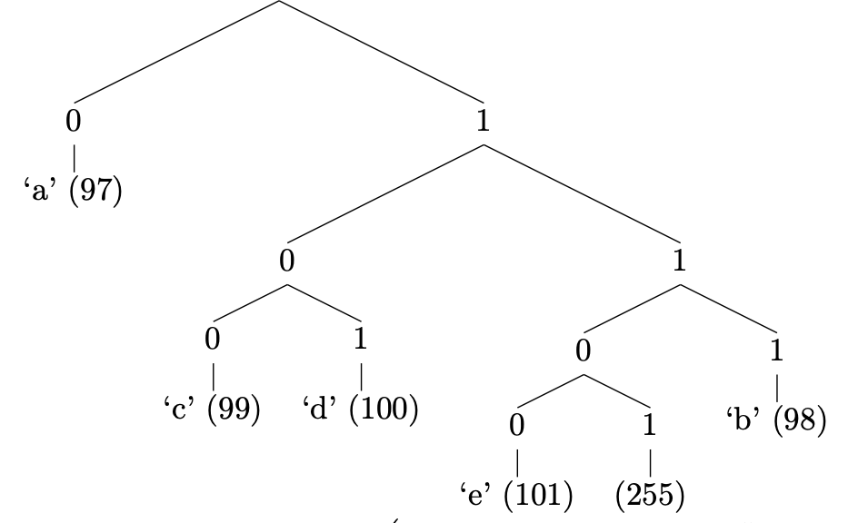

[](https://classroom.github.com/a/6eJown1x)
[](https://classroom.github.com/online_ide?assignment_repo_id=12587591&assignment_repo_type=AssignmentRepo)
# Домашнее задание 5

Напишите программу, выполняющую сжатие двухпроходным [алгоритмом Хаффмана](https://en.wikipedia.org/wiki/Huffman_coding). Покройте ваш код юнит-тестами.

## Параметры командной строки

Программа должна принимать в качестве аргументов ключ `-c` или `-d` для сжатия или распаковки соответственно, входной файл и выходной файл.

```shell
$ huffman [-v] (-c|-d) input_file output_file
```

Программа должна выводить на экран статистику сжатия/распаковки: размер исходных данных, размер полученных данных и размер, который был использован для хранения вспомогательных данных (например, таблицы).

**Внимание!** Не должно выводиться никакого дополнительного текста, только размеры. Все размеры в байтах.

## Пример опций командной строки

```shell
$ ./huffman -c myfile.txt result.bin
15678
6172
482
```

Размер исходного файла (исходные данные): `15678` байт, размер сжатых данных (без дополнительной информации): `6172` байта, размер дополнительных данных: `482` байта. Размер всего сжатого файла: `6172` + `482` = `6654` байта.

```shell
$ ./huffman -d result.bin myfile_new.txt
6172
15678
482
```
Размер распакованного файла (полученные данные): `15678` байт, размер сжатых данных (без дополнительной информации): `6172` байта, размер дополнительных данных: `482` байта. Размер всего исходного сжатого файла: `6172` + `482` = `6654` байта.

Обратите внимание, что **выводимые размеры это НЕ размеры входного и выходного файлов**.

Если программе передан ключ `-v`, необходимо после вывода статистики сжатия или распаковки для каждого символа вывести используемую последовательность бит для его кодирования и через пробел десятичный код символа. Последовательности бит должны быть отсортированы в лексикографическом порядке.

## Пример сжатия

Рассмотрим пример сжатия и распаковки файла `verbose_example.in`.

Файл `verbose_example.in` содержит 15 байт:

```
aaaaaabbbccdde\xff
```

где `\xff` соответствует символу с десятичным кодом `255`.

Данному входному файлу соответствует следующее дерево Хаффмана:



**Замечание!** В общем случае оптимальное кодовое дерево задаётся входом неоднозначно: существует несколько эквивалентных оптимальных кодовых деревьев (например, можно инвертировать все биты в кодах Хаффмана и получить оптимальные коды Хаффмана).

Пример результата сжатия с ключом `-v` (с выводом используемой последовательности
бит для кодирования каждого символа):

```shell
$ ./huffman -v -c verbose_example.in compressed.bin
15
5
42
0 97
100 99
101 100
1100 101
1101 255
111 98
```

Статистика сжатия в первых стрёх строках: `15` байт — размер расжатых данных (исходного файла), `5` байт — размер сжатых данных (без дополнительной информации), `42` байта — размер дополнительных данных.

Итоговой размер `compressed.bin`: `5` + `42` = `47` байт.

В оставшихся строках бинарные коды, соответствующие каждому символу:
* `0 97` — символ `a`, имеющий десятичный ASCII код `97`, кодируется битовой последовательностью, соcтоящий из одного нуля: `0`.
* `100 99` — символ `c`, имеющий десятичный ASCII код `99`, кодируется битовой последовательностью `100`.
* ...
* `111 98` — символ `b`, имеющий десятичный ASCII код `98`, кодируется битовой последовательностью `111`.

Строка:
```
aaaaaabbbccdde\xff
```
кодируется следующим потоком бит:
```
0 0 0 0 0 0 111 111 111 100 100 101 101 1100 1101
```

Этот поток бит упаковывается в пять байт:
```
00000011 11111111 00100101 10111001 101
```
в последнем байте используется только три бита, остальные биты байта заполняются, например, нулями.

## Распаковка

Пример результата распаковки с ключом `-v` сжатого файла `compressed.bin`:

```shell
$ ./huffman -v -d compressed.bin verbose_example_new
5
15
42
0 97
100 99
101 100
1100 101
1101 255
111 98
```

## Тестирование

Помимо самого алгоритма вам нужно будет покрыть ваш код юнит-тестами. Протестируйте решение на типичных граничных случаях, удостоверьтесь, что после разжатия сжатого файла получается исходный файл:
* для пустого файла;
* для файла, содержащего ровно один байт;
* для файла, содержащего байт с кодом ноль;
* для файла, содержащего байт с кодом 255;
* для файла, содержащего ровно 256 различных байт;
* для файла, содержащего только два одинаковых байта;
* для больших текстовых файлов;
* для больших бинарных файлов;
* для больших файлов, содержащих случайные байты и, соответственно, плохо сжимающиеся.

## Ограничения

* Наибольший размер входного файла — **5MB**.
* Ограничение на время выполнения — **5 секунд**.
* Сжатие подразумевает представление данных в компактном виде: не следует сериализовывать таблицу частот в результирующий файл в текстовом виде, или записывать сжатый алгоритмом Хаффмана поток в текстовом виде. Однако не требуется пытаться достичь максимальной эффективности сжатия, например, пытаясь сжать таблицу частот при её записи в архив.
* Не выводите на экран ничего, кроме требуемой статистики, а статистику выводите ровно в том формате, который указан в условиях.

## Рекомендации

* Для работы с файловой системой удобно использовать абстракции из заголовочного файла `<filesystem>` (доступно начиная с С++17);
* Не выводите на экран ничего, кроме сообщений об ошибках, которые указаны в условиях. Ошибки необходимо выводить в `std::cerr`.
* В решении не допускаются утечки памяти. Убедитесь, что при возникновении ошибок вы корректно освобождаете все выделенные ресурcы.
* Открывайте файлы средствами С++. Запрещено использование средств C (`fprintf()`, `fopen()`).
* Открывайте файлы в двоичном режиме (`std::ios_base::binary`). В противном случае результат записи изображения может оказаться не переносимым между платформами.
* Используйте разные экземпляры класса `std::ifstream` для чтения разных файлов. Используйте то, что `std::ifstream` автоматически закроет файл, когда экземпляр класса будет уничтожен, не вызывайте std::ifstream::close() когда это не требуется.
* Если вы записываете целочисленные переменные в двоичном виде в файл, убедитесь, что вы используете тип фиксированного размера (например, `std::uint32_t`, но не `long`).
* Убедитесь, что ваше решение переносимо между платформами с разными размерами базовых типов. Например, если вы записываете целочисленное число в двоичном виде в файл, используйте тип фиксированного размера, например, `std::uint32_t`, но не `int`, `long` или `std::size_t`, которые могут иметь разные размеры на разных платформах. Проблемой little-endian/big-endian можно пренебречь.
* Для работы с байтами рекомендуется использовать тип `std::uint8_t` или по крайней мере `unsigned char`, но не `char`, т.к. с ним могут быть проблемы со знаковостью.
* Не допускайте изменений входного файла.
* В заголовочных файлах необходимо включать только минимально необходимые заголовочные файлы.
* Передавайте неизменяемые экземпляры классов по константной ссылке.
* Если метод класса не изменяет состояние класса, сделайте его константным.
* Если вы передаёте объект по указателю или ссылке и не будете его модифицировать, передавайте его явно константным.
* Используйте тип `size_t` для размеров и индексов, диапазона значений типа `int` может не хватить.
* Используйте `nullptr` вместо `0` или `NULL` для нулевых указателей.
* Используйте передачу по ссылке вместо передачи по указателю. Указатель может быть нулевым; указатель заставляет задуматься о том, должна ли функция освобождать память, на которую указывает указатель.
* Избегайте дублирования кода: вынесите общий код в отдельные функции.
* Не стоит использовать `using namespace std;` в заголовочных файлах, т.к. не все пользователи заголовочного файла могут хотеть вносить содержимое `namespace std` в корневую область видимости.
* Приватные члены класса следует именовать с подчеркиванием на конце.
* Если вы используете исключения:
  * В качестве типов исключений либо используйте исключения из стандартной библиотеки (`std::runtime_error`, `std::invalid_argument`), либо создайте свой класс исключения, унаследовав его от `std::exception` или `std::runtime_error`.
  * Передавайте текст ошибки в исключении (см. `std::exception::what()`) и выводите его там, где ловите исключение.
  * Ловите исключения по константной ссылке, если не собираетесь их модифицировать.
* Имена, начинающиеся с подчеркивания и большой буквы, и имена, содержащие два последовательных подчеркивания, зарезервированы для реализации компилятора и стандартной библиотеки. Такие имена нельзя использовать в стражах включения.
* Не стоит передавать скалярные типы (size_t, int, double и т.п.) по ссылке.
* Нельзя использовать `exit()` для обработки ошибок. Функция `exit()` никогда не возвращается и выделенные ранее ресурсы никогда корректно не освобождаются (например, явно не освобождается память выделенная внутри `std::string`).
* Пользуйтесь инвариантами (`assert`) корректно, они могут помочь отлаживать программу.
* При объявлении функции или метода указывайте имена аргументов, это делает интерфейс существенно более понятным.
